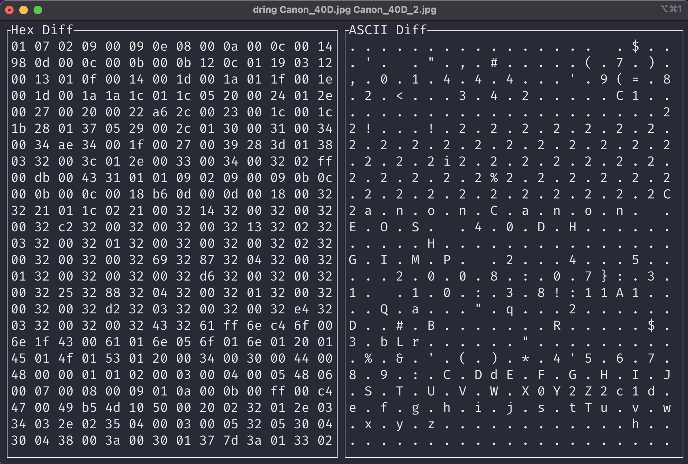

[](https://github.com/ztroop/dead-ringer/actions/workflows/build.yml)

# dead-ringer

A command-line tool written in Rust that compares two binary files and displays the differences. It uses a terminal-based user interface to present a side-by-side comparison, showing both hexadecimal and ASCII representations of the differing bytes.

## Features

- CLI Diff Viewer for Hex and ASCII.
- Color highlighting for different data types to enhance readability.
- Keyboard navigation enables interactive exploration of differences.
- Displays bit position for focused data, aiding in precise location identification.

## Installation

```sh
git clone git@github.com:ztroop/dead-ringer.git && cd ./dead-ringer
cargo install --path .
```

## Usage

```
Usage: dring <file1> <file2>

Arguments:
  <file1>  Path to the first binary file
  <file2>  Path to the second binary file
```

## Color Reference

|Type of Byte|Color|
|---|---|
|NULL| Gray|
|OFFSET| Gray|
|ASCII Printable| Cyan|
|ASCII Whitespace| Green|
|ASCII Other| Green|
|Non-ASCII| Yellow|

## Demonstration



## Alternatives

If you're looking for a full-featured Hex/ASCII viewer, check out [Hexyl](https://github.com/sharkdp/hexyl)!